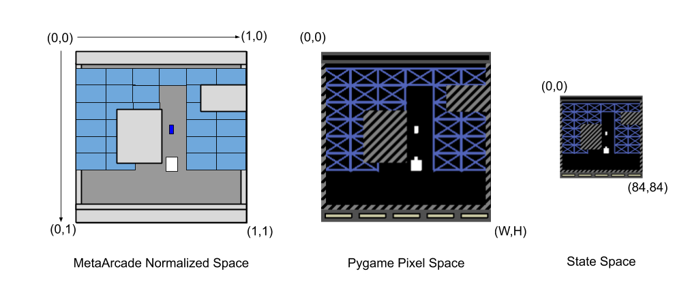
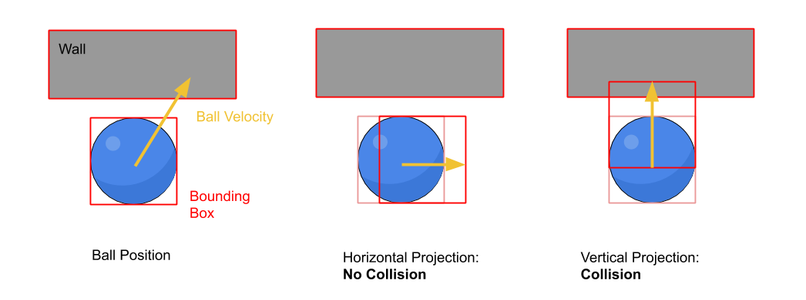

### Documentation Pages:

1. [Game Mechanics](./documentation/GameMechanics.md)

2. [Configuration Files](./documentation/ConfigurationFiles.md)

3. [Parameter Distributions](./documentation/ParameterDistributions.md)

4. [Building Curricula](./documentation/BuildingCurricula.md)

5. [Additional Tools](./documentation/AdditionalTools.md)

6. [Meta Arcade Inner Workings](./documentation/InnerWorkings.md)


Meta Arcade Inner Workings
===

This document describes the basic design and flow of the Meta Arcade code. Most users should not need to edit this portion of the codebase, but it may be helpful for understanding the environment or extending it.


## Game Flow (MetaArcade.py)

Meta Arcade games are instances of the MetaArcade class, which handles the overall flow of the game including conforming to the the gym interface. 

The game consists of two other pieces: Game Elements and the Game Display. 

**Game elements** are classes which describe some object in the game, including its behavior, rendering, collision with other objects, rewards, etc. Everything in the game (besides the background and the score indicators) is a game element. 

The **Game Display** is a separate class which controls the pygame drawing surface and the transformation from the rendered surface into a numpy array for representing the game state. A reference of the display is passed to each game element so that the game element can control its own rendering.

The pseudocode for the game is something like:

```
Initialize():
	Read in initial config object
	Set up observation and action spaces
	Set up any resusable game elements

Reset():
	Construct the game display instance if it does not exist
	Parse the current configuration and use it to:
		Construct game elements with proper settings
        Place game elements in the scene
   	
   	return the results of Draw()

Step(action):

	Use the action to set player velocity

	For some number of inner game steps ("ticks", default to 2):
		Iterate through all game elements:
			Pass each element a reference to all other elements
			Each element will run collision detection and calculate the results
			Each element will return any changes in reward and whether the game is over
			
		Step all game elements forward
		
		get state from Draw()
		
		return state, sum of reward changes, game over, {}
		
Draw():
	Clear the display
	For each game element:
		Ask the element to render
	Render the game border and indicators
	Convert pygame rendering to np array

```


## Coordinate Spaces

MetaArcade uses a normalized coordinate space for positions and velocities, which can be mapped to an arbitrarily-sized rectangle for rendering. The MetaArcade class and game elements typically use this normalized space, while the display class converts these values into pixel coordinates. The pixel data is downsized to 84x84 to create the game image state.



The use of normalized coordinates is why many values for MetaArcade are small decimals: positions and velocities are often expressed in hundredths or thousandths of the game area size. The pygame display is 250px by 250px, but the Display class can use other values if desired.


## Game Elements (GameElement.py and Elements.py)

Game element classes (base class GameElement) encapsulate the behavior of a specific type of game object, such as the player, ball, blocks, walls, etc. The given class is responsible for handling the object position, velocity, collision handling, and drawing.  The following methods are the most important:

1. ```reset(self)``` is called on each object at the beginning of an episode to set an initial placement and velocity. Some objects also have a more sophisticated ```configure``` method if special handling is needed (i.e. for arranging blocks in a grid).

2. ```subtick(self, game_elements)``` is called by MetaArcade to have this object respond to any other objects, primarily by altering velocity due to collision, calculating a changing in score, or removing objects from the game. This method does not actually move the object, but rather sets the intended velocity for the next game tick. This method returns any change in score.

   Note that each type of collision should only be handled by one party. For example, the ```Ball``` class handles collisions with ```Block``` objects, but not the other way around.

3. ```draw(self, display)``` is called by MetaArcade to ask an object to draw itself onto the pygame surface. A reference to the Display object is passed for use.  The Display has several utility functions which help with coordinate conversion, see the next section for details.


## Collisions

Collisions in MetaArcade are handled with simple rectangular bounding boxes. At each frame, each object projects its bounding box forward by its current velocity and checks if it would eclipse another object.  If so, it is considered a collision. For the ball, this means that its velocity is changed, but for other objects this simply means zeroing out the velocity in a particular direction. Not all collisions are handled; for example, a block cannot collide with a wall.

The collision detection is performed in the horizontal and vertical directions separately to determine which component of velocity is the cause of the collision. The elements in pygame are typically moving slowly enough that this approximate method is acceptable. While in theory it could lead to objects glitching through each other or false positives on collisions, nothing is dynamic enough for this to be a concern.




## Rendering (GameDisplay.py)

MetaArcade has a single instance of the GameDisplay class, which handles all the pygame drawing and the creation of the state imagery. Most functionality in this class consists of direct drawing commands from pygame such as rectangles, circles, and lines.  These are also used within the game elements to draw each object.

An exception to this is the drawing of the walls and static barriers, which are handled separately to create a striped texture.  To avoid drawing many stripes at each frame, the drawing area is filled with striped at the beginning of each game, and the portions of the screen representing walls are saved.  This entire region is copied over to the drawn frame at each step.

The display also handles the conversion of the pygame drawing surface to the game state, including the application of color distortion, rotation, and inversion. If you run MetaArcade with rendering (headless=False), you will find that these distortions are not shown because they are not drawn in pygame. To see the distorted image that the game outputs, try displaying the state with opencv:

````python
cv2.namedWindow("state", cv2.WINDOW_NORMAL) 
cv2.imshow("state", s)
cv2.waitKey(1)
````

